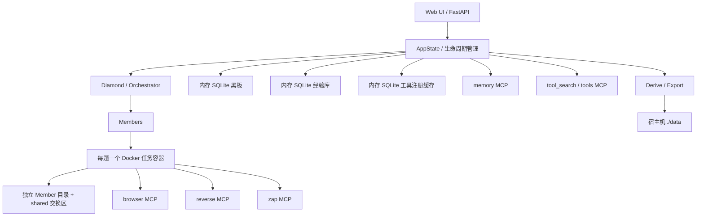

<p align="center">
  
</p>

<h1 align="center">IPC_CTFAgent</h1>

<p align="center"><strong>面向授权 CTF 场景的多智能体协作解题系统</strong></p>

<p align="center">
  <a href="LICENSE"></a>
  <a href="https://www.python.org/"></a>
  <a href="https://www.docker.com/"></a>
  <a href="https://modelcontextprotocol.io/"></a>
  <a href="https://fastapi.tiangolo.com/"></a>
</p>

> 本项目仅用于合法授权的 CTF、靶场、教学和安全研究。应用会挂载 Docker Socket，并包含扫描、浏览器自动化、二进制分析和命令执行能力，请只在可信、隔离的环境中运行。

IPC_CTFAgent 以 **Diamond** 作为调度者，以多个 **Member** 作为解题执行者。系统通过共享黑板记录事实、意图、报告和成员状态，在同一道题的共享任务容器中并行探索，并将 Browser、Reverse、ZAP、Memory 和工具检索能力统一为异步 MCP 服务。

本项目基于 [oritera/Cairn](https://github.com/oritera/Cairn) 的思路继续开发。

## 目录

- [核心能力](#核心能力)
- [系统架构](#系统架构)
- [快速开始](#快速开始)
- [配置说明](#配置说明)
- [使用流程](#使用流程)
- [导出与持久化](#导出与持久化)
- [Memory 工具目录](#memory-工具目录)
- [MCP 服务](#mcp-服务)
- [Reverse MCP](#reverse-mcp)
- [Web API](#web-api)
- [本地开发与测试](#本地开发与测试)
- [项目结构](#项目结构)
- [已知限制](#已知限制)

## 核心能力

### Diamond–Member 协作

- Diamond 创建、分派和回收任务，并依据 Member 的进度与难度报告决定是否增援。
- Member 拥有独立上下文和 `/workspace/<member>` 工作目录。
- 同一道题的 Member 共享任务容器、附件和 `/workspace/shared` 交换区。
- 已确认的事实、待办意图、难度报告和关系边写入共享黑板，Web UI 可实时展示和回放。
- 项目完成前会检查 Flag、完成边和 Writeup，避免仅凭模型文本误报成功。

### 七类 CTF 能力

| 分类 | 代表能力 |
| --- | --- |
| Web | SQLMap、Dirsearch、Commix、Fenjing、WhatWaf、ZAP、Playwright |
| Pwn | GDB、Pwntools、ROPgadget、one_gadget、Checksec |
| Reverse | 隔离 PyGhidra worker、radare2、objdump、readelf、angr |
| Crypto | SageMath、CADO-NFS、RsaCtfTool、PyCryptodome、Z3、fpylll |
| Misc / Forensics | Binwalk、ExifTool、Steghide、zsteg、Volatility3、OCR、音视频工具 |
| AI | PyTorch、Keras、NumPy、SciPy、Pillow、h5py |
| OSINT | curl、Nmap、元数据分析、浏览器自动化 |

任务镜像还预装 Bash、Python、Java 21/Maven、Go、Rust、PHP、JavaScript/Node.js 和 Ruby。完整清单以 [工具注册表](backend/tools/registry/)及 [Catalog 清单](backend/tools/catalog.yaml)为准。

### 可观察的解题闭环

```text
created → running → flag_found → wp_writing → memory_writing → completed
            ↑
          stopped ───────────────→ running
```

Web UI 提供：

- 项目创建、附件上传、提示和题型选择；
- 启动、停止、恢复、重新打开和删除项目；
- 协作图谱、事实链、意图、报告、成员状态和时间线；
- 项目、LLM、工具和 Memory 四类日志；
- Writeup、日志和 Memory Vault 导出；
- LLM 配置编辑与健康检查；
- 内置工具目录和用户经验记忆两个 Memory 视图。

界面示例见 [docs/Example.md](docs/Example.md)。

## 系统架构



运行期的黑板、经验库和工具缓存均使用内存 SQLite。应用退出时按 `ToolRegistry → MemoryStore → Database` 顺序显式关闭；FastAPI 和独立 MCP Server 都通过 lifespan 在正常退出及异常路径释放自己拥有的资源。

## 快速开始

### 1. 获取项目

```bash
git clone https://github.com/PureStream108/IPC_CTFAgent.git
cd IPC_CTFAgent
```

### 2. 创建配置

Linux / macOS：

```bash
cp backend/config/config.example.yml backend/config/config.yaml
```

Windows PowerShell：

```powershell
Copy-Item backend\config\config.example.yml backend\config\config.yaml
```

编辑 `backend/config/config.yaml`，至少配置一个 Diamond 和一个可用 Member。不要把真实 API Key 提交到仓库。

### 3. 构建并启动

```bash
docker compose up -d --build
```

Compose 会构建主应用镜像和 `ipc-task:latest` 任务镜像，并启动共享 ZAP 服务。首次构建需要下载 Ghidra、JDK、Chromium、SageMath、PyTorch 和多种 CTF 工具，耗时和磁盘占用较大。

检查状态：

```bash
docker compose ps
docker compose exec ipc-app ipc check
docker compose logs -f ipc-app
```

打开 [http://localhost:8000](http://localhost:8000)。

停止服务：

```bash
docker compose down
```

`./data` 目录若删除了 docker 容器，则里面的文件会被删除，所以请及时转移

## 配置说明

最小示例：

```yaml
log_enabled: true

diamond:
  api_format: openai
  api_key: sk-...
  base_url: https://your-endpoint.example/v1
  model: your-model

members:
  - name: aventurine
    api_format: openai
    api_key: sk-...
    base_url: https://your-endpoint.example/v1
    model: your-model

runtime:
  sandbox_backend: docker
  interval: 2
  eval_interval_steps: 20
  intent_timeout: 30
  reason_timeout: 30
  max_members_per_report: 4
  max_member_steps: 60
  max_member_actions_per_task: 20

limits:
  total_cpu: 4
  max_concurrent_tasks: 5
  network: true
```

支持的 `api_format` 包括 `openai`、`claudecode`、`deepseek`、`pi` 和 `mock`。未显式填写模型时，默认值来自 [backend/config/models.yaml](backend/config/models.yaml)，不要在测试或文档中硬编码某个历史默认模型。

常用命令：

```bash
ipc check     # 检查启动所需配置
ipc health    # 检查 Diamond 和 Member 的 LLM 端点
ipc serve     # 启动 API 与 UI
```

## 使用流程

1. 在 Web UI 中点击 **New Project**。
2. 填写题目名称、来源、目标、题型和提示，按需上传附件。
3. 启动项目，由 Diamond 分配初始任务。
4. 在图谱、时间线和日志中观察 Member 的事实、意图和工具调用。
5. 找到 Flag 后，系统进入 Writeup、Memory 总结和完整性检查。
6. 使用 WP、Logs 和 Memory 面板的 **Derive / Export** 将需要保留的内容写入 `./data`。

项目附件和运行状态默认是临时数据。删除容器或重新创建应用后，未导出的运行期状态不会恢复。

## 导出与持久化

Compose 只将宿主机 `./data` 挂载为持久化目录：

| 宿主机目录 | 内容 | 环境变量 |
| --- | --- | --- |
| `./data/Wp/` | 已完成项目的 Writeup 快照 | `IPC_WP_EXPORT_DIR` |
| `./data/logs/project_logs/` | 项目生命周期日志 | `IPC_LOG_EXPORT_DIR` |
| `./data/logs/llm_logs/` | LLM 请求与响应日志 | `IPC_LOG_EXPORT_DIR` |
| `./data/logs/tool_logs/` | 工具调用日志 | `IPC_LOG_EXPORT_DIR` |
| `./data/logs/memory_logs/` | Memory 写入日志 | `IPC_LOG_EXPORT_DIR` |
| `./data/memory/vault/` | Obsidian 格式的经验库 | `IPC_MEMORY_EXPORT_DIR` |

### WP 与日志的无损命名

Derive 只新增快照，不删除、不清空、不覆盖目标目录中的已有内容。

- 首次 WP：`任务名称.md`
- 首次日志：`任务名称.log`
- 重名后：`任务名称01.md` / `任务名称01.log`，然后是 `02`、`03`……
- 冲突检测不区分文件名大小写。
- 重复点击 Derive 会创建下一个编号，而不是覆盖旧快照。
- 同一任务在四个日志目录中始终使用相同编号。
- 日志扩展名为 `.log`，内容仍是 UTF-8 JSON Lines，每行可独立解析为 JSON。
- 文件名会清理操作系统非法字符并限制长度。
- 进程内导出锁配合独占文件创建，避免并发请求选中同一名称。

接口响应结构保持兼容：

```text
POST /wp/derive
POST /logs/derive
POST /memory/derive
```

## Memory 工具目录

Memory 窗口分为两个视图：

- **工具目录**：只读的预装能力手册；
- **经验记忆**：当前运行期积累的用户/项目经验。

当前 Catalog 包含 79 个稳定 ID 和 79 份独立 Markdown 文档：

| 类型 | 数量 | 内容 |
| --- | ---: | --- |
| 工具 | 46 | 43 条 ToolRegistry 能力及任务镜像中的核心命令行工具 |
| MCP | 6 | `memory`、`tool_search`、`tools`、`browser`、`reverse`、`zap` |
| 语言 | 8 | Bash、Python、Java、Go、Rust、PHP、Node.js、Ruby |
| 解题库 | 19 | 镜像中直接用于解题的 Python/Ruby 库 |

每个条目只有一份 Markdown，可从多个目录节点引用。文档包括用途、版本检查、命令或 import、镜像路径、工作流、可执行示例、输出解释、错误与限制、关联条目和官方参考。

Catalog 在启动时严格检查：

- ID 是否唯一；
- 文档是否存在；
- 内部关联 ID 是否有效；
- Markdown 内部链接是否有效；
- 必填章节是否完整。

清单和文档位于：

- [backend/tools/catalog.yaml](backend/tools/catalog.yaml)
- [backend/tools/catalog_docs/](backend/tools/catalog_docs/)

修改清单后可重新生成文档骨架：

```bash
python scripts/generate_catalog_docs.py
```

### Memory API

```text
GET /memory/catalog
GET /memory/catalog/{id}
GET /memory/catalog/{id}/document
```

详情接口返回元数据、原始 Markdown 和由可信内置文档生成的 HTML；`/document` 以 `text/markdown` 返回原文。Catalog 不会写入经验数据库，也不会导出到用户的 Obsidian Vault。

### Memory MCP

- `memory_search`：先返回匹配的用户经验，再用 Catalog 结果补足；原字段保持不变，并增加 `entry_type`、`doc_id`、`doc_url`。
- `memory_get`：继续只读取用户经验。
- `memory_catalog(path?)`：浏览目录树。
- `memory_doc(id)`：读取某个条目的完整 Markdown。

## MCP 服务

项目基于官方 Python `mcp` SDK 的 `FastMCP`，支持进程内、stdio 和 Streamable HTTP。

| Server | 运行位置 | 主要用途 |
| --- | --- | --- |
| `memory` | 应用进程或独立 Server | 经验检索与工具目录 |
| `tool_search` | 应用进程或独立 Server | 跨题型检索完整工具注册表 |
| `tools` | 应用进程或独立 Server | 暴露指定题型的工具 |
| `browser` | 任务容器 | Playwright Chromium 导航与交互 |
| `reverse` | 任务容器 | PyGhidra、radare2、Checksec、ELF 信息 |
| `zap` | 任务容器调用共享 ZAP | Web 爬取与授权扫描 |

启动 stdio Server：

```bash
python -m backend.mcp.mcp_server memory
python -m backend.mcp.mcp_server tools --category reverse
```

通过 Client 调用：

```bash
python -m backend.mcp.mcp_client memory memory_search \
  --arguments '{"query":"PyGhidra"}'
```

启动 Streamable HTTP：

```bash
python -m backend.mcp.mcp_server memory \
  --transport streamable-http --host 0.0.0.0 --port 8100
```

Python 进程内复用：

```python
from backend.mcp.mcp_client import MCPClient
from backend.memory.memory_mcp import build_memory_mcp
from backend.memory.memory_store import MemoryStore

store = MemoryStore("memory.db", in_memory=True).configure()
server = build_memory_mcp(store)

try:
    async with MCPClient.in_process(server) as client:
        result = await client.call_tool("memory_search", {"query": "sqlmap"})
finally:
    store.close()
```

独立 `memory`、`tool_search` 和 `tools` Server 会通过 FastMCP lifespan 关闭自己拥有的 store/registry；由 `AppState` 注入的共享实例统一由 `AppState.close()` 释放。

## Reverse MCP

Reverse MCP 提供：

```text
decompile
decompile_all
list_functions
strings
disassemble
r2_cmd
checksec
file_info
```

所有 Ghidra 型操作都在独立子进程和独立临时项目目录中执行：

1. worker 以 `open_program(analyze=False)` 打开程序；
2. 使用带超时 monitor 的显式分析；
3. 父进程施加总硬超时；
4. 超时或失败时结束并等待 worker，随后清理临时项目；
5. program/project 由上下文管理器显式关闭，不依赖父进程全局 JVM 缓存。

`decompile` 的 Ghidra 路径失败后会降级到 radare2：

1. 执行 `aaa` 和 `aflj`；
2. 将裸函数名、`sym.` / `dbg.` / `fcn.` 名称或地址解析为数值地址；
3. 只对解析出的数值地址执行 `pdf`，不把用户函数名直接拼入命令；
4. 只有非空反汇编才返回 `available: true`。

`decompile` 响应结构保持兼容；`decompile_all`、`list_functions`、`strings` 和 `disassemble` 增加了可选总超时参数，旧调用无需修改。

## Web API

启动后可访问：

- Web UI：`GET /`
- OpenAPI：`GET /docs`
- ReDoc：`GET /redoc`

主要接口分组：

| 分组 | 代表接口 |
| --- | --- |
| 项目 | `GET/POST /projects`、附件、提示、意图和结论 |
| 解题 | `start`、`stop`、`resume`、`reopen`、报告和完成 |
| 图谱 | `/projects/{id}/export`、`/projects/{id}/replay` |
| WP | `/projects/{id}/wp`、`/wp/completed`、`/wp/derive` |
| 日志 | `/logs/status`、`/logs/projects`、`/logs/derive` |
| Memory | `/memory`、`/memory/search`、`/memory/catalog`、`/memory/derive` |
| 配置 | `/config`、`/config/runtime`、`/config/health` |
| 平台 | `/api/platform/challenges`、`/api/platform/import` |
| Flag | `/api/flags`、`/api/flags/{project_id}` |

平台导入接口的认证头只在单次请求内使用，不写入配置或数据库。当前 API 没有内置访问控制，只应在可信隔离网络中开放 8000 端口。

## 本地开发与测试

### 本地运行

```bash
python -m venv .venv
source .venv/bin/activate
# Windows PowerShell: .venv\Scripts\Activate.ps1

pip install -e ".[docker,dev]"
cp backend/config/config.example.yml backend/config/config.yaml
ipc check
ipc serve --reload
```

本地 API 默认仍使用 Docker 任务沙箱，因此应先构建任务镜像：

```bash
docker compose build ipc-task-image
```

### 自动化测试

```bash
pytest -q
```

测试覆盖：

- 黑板、调度、项目生命周期和配置；
- WP/日志无损导出、重名、非法字符和并发创建；
- Reverse worker 硬超时、清理、函数解析和空 fallback；
- 内存 SQLite 多线程 fallback、幂等关闭和 lifespan 异常路径；
- Catalog 完整性、API、MCP 检索和前端目录交互；
- Docker Compose 与任务镜像配置。

### 可选 C5 任务镜像验收

构建 `ipc-task:latest` 后可运行：

```bash
docker run --rm \
  -v "$PWD/scripts:/acceptance:ro" \
  ipc-task:latest \
  bash /acceptance/c5_task_acceptance.sh
```

脚本用于检查 Java/Maven、ysoserial、Ghidra/PyGhidra、Reverse/r2、CADO-NFS、常用命令、Python 解题库和 Playwright Chromium。只有脚本输出 `[C5] all task-image checks passed` 才代表该镜像完成 C5 验收；仓库不因存在该脚本而默认声明镜像已经通过。旧版 ysoserial 与 JDK 21 存在上游兼容性限制，相关步骤可能需要兼容运行时或预构建 JAR。

## 项目结构

```text
IPC_CTFAgent/
├─ backend/
│  ├─ api/                    # FastAPI 路由
│  ├─ blackboard/             # 共享黑板与图谱存储
│  ├─ config/                 # 配置模板、模型默认值
│  ├─ core/                   # Diamond、调度、生命周期、导出写入
│  ├─ mcp/                    # MCP client/server、Reverse worker
│  ├─ members/                # Member 与 LLM 适配器
│  ├─ memory/                 # 经验存储、检索和 Memory MCP
│  ├─ platform/               # 通用比赛平台导入适配器
│  ├─ sandbox/                # Docker/本地任务沙箱与网络
│  ├─ server/                 # FastAPI 应用装配
│  ├─ tools/                  # 工具注册表、Catalog、Markdown 文档
│  └─ sqlite_util.py          # 可显式关闭的内存 SQLite
├─ frontend/                  # 单页 Web UI 与静态资源
├─ docker/member/Dockerfile   # ipc-task 工具镜像
├─ scripts/                   # Catalog 生成、独立运行、C5 验收
├─ tests/                     # pytest 回归测试
├─ data/                      # 宿主机导出目录
├─ Dockerfile                 # 主应用镜像
├─ docker-compose.yml
└─ pyproject.toml
```

## 已知限制

- 任务镜像包含 Ghidra、Chromium、SageMath、PyTorch 和大量 CTF 工具，首次构建慢且磁盘占用较大。
- 应用通过 Docker Socket 管理任务容器，等同于拥有较高的 Docker 主机权限。
- 运行期黑板、经验和工具缓存只驻留内存；必须主动 Derive 才会持久化需要保留的产物。
- API 暂无鉴权、租户隔离和公网部署防护。
- PyGhidra 的 monitor 不能保证所有分析器及时响应，因此 Reverse MCP 仍需父进程硬超时。
- ysoserial 上游源码面向旧 Java 版本，直接使用 JDK 21 构建或运行部分 gadget 可能失败。
- C5 任务镜像验收依赖完整 Docker 环境和部分外部下载源，应以实际脚本终态为准。

## 贡献

欢迎提交 Bug、测试题目、工具注册、Catalog 文档和代码改进：

1. Fork 仓库并创建功能分支；
2. 为行为变更补充或更新测试；
3. 运行 `pytest -q`；
4. 提交清晰的 Pull Request，说明动机、实现和验证结果。

新增工具时通常需要同步更新：

- `backend/tools/registry/*.yaml`
- `backend/tools/member_tools.txt`
- `backend/tools/catalog.yaml`
- `backend/tools/catalog_docs/*.md`
- 对应测试

## 许可证

本项目采用 [GNU Affero General Public License v3.0](LICENSE)。

## 联系与反馈

- [GitHub Issues](https://github.com/PureStream108/IPC_CTFAgent/issues)
- [GitHub Pull Requests](https://github.com/PureStream108/IPC_CTFAgent/pulls)
- [项目主页](https://github.com/PureStream108/IPC_CTFAgent)
