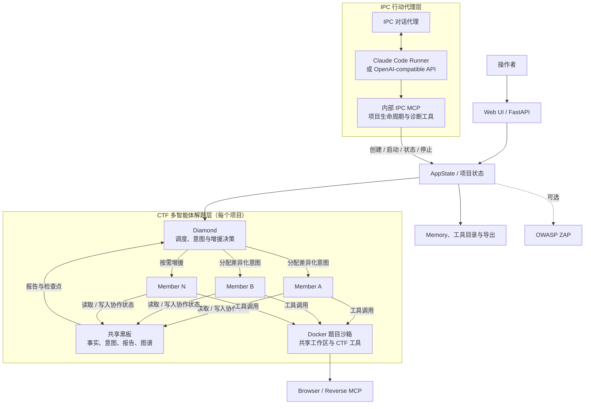
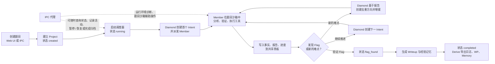

<p align="center">
  
</p>

# IPC CTF Agent

面向**合法授权的 CTF、靶场、教学与安全研究**场景的多智能体解题系统。它提供 Web 控制台、Docker 题目沙箱、共享黑板、工具/MCP 服务、结果归档，以及一个可持续对话的 IPC 行动代理。

> 本项目会管理 Docker 容器，并可在启用 IPC 行动代理时通过 Docker Socket 执行宿主机级操作。请只在可信、隔离的环境中部署，绝不能将其直接暴露到公网。

## 功能概览

- **多智能体协作**：Diamond 负责调度；多个 Member 在同一题目沙箱中并行探索，并通过共享黑板交换事实、意图、报告与进度。
- **完整解题流程**：项目状态依次覆盖 `created`、`running`、`flag_found`、`wp_writing`、`memory_writing`、`completed`，支持停止、恢复和重新打开。
- **题目项目管理**：在 Web UI 创建项目、上传附件、录入提示、查看协作图、事件时间线、日志和 Writeup。
- **CTF 工具环境**：题目镜像包含 Web、Pwn、Reverse、Crypto、Misc、AI、OSINT 等常用运行时与工具；每个项目共享一个隔离的任务容器。
- **MCP 能力**：内置记忆、工具检索、分类工具、浏览器、逆向分析和可选 ZAP 服务。
- **知识沉淀**：可浏览内置工具目录与项目经验记忆，并将 Writeup、日志和 Memory Vault 导出到宿主机目录。
- **平台接入**：支持通过字段映射导入题目；IPC 可生成声明式平台工作流，工作流须经人工确认后才能执行。
- **IPC 行动代理**：可选择 Claude Code 原生运行器或 OpenAI-compatible API，能够诊断运行环境、操作题目沙箱和辅助平台接入；对话、运行日志和工作流保存在 `data/ops-agent/`。

## 系统架构

### IPC、Diamond 与 Member 的关系

IPC 和 Diamond 是两个协作层：IPC 负责面向操作者的持续对话、环境诊断与平台工作流；Diamond 负责一个 CTF 项目内的任务分派和 Member 调度。IPC 通过内部 MCP 创建、启动、观察或停止项目，而不会直接替代 Diamond 的调度职责。



### 一次解题任务的工作流



黑板、运行期记忆和工具缓存均为内存数据；应用容器重建后不会恢复。通过界面中的 **Derive** 导出需要保留的 Writeup、日志和记忆。

## 快速开始

### 前置条件

- Docker Engine 与 Docker Compose v2
- 可访问 Docker Socket 的 Linux Docker 主机；Compose 同时会挂载 `/var/run/docker.sock` 和 Docker Compose 插件
- 至少一个可用的 LLM 端点（开始解题时需要）

首次构建会下载 Ghidra、Chromium、SageMath、PyTorch 和较多 CTF 工具，耗时与磁盘占用都比较高。

### 启动

```bash
git clone https://github.com/PureStream108/IPC_CTFAgent.git
cd IPC_CTFAgent
docker compose up -d --build
```

检查服务：

```bash
docker compose ps
docker compose exec ipc-app ipc check
docker compose logs -f ipc-app
```

打开 <http://localhost:8000>，首次进入时创建至少 12 位的本地管理员密码。随后在 **IPC** 配置面板中填写 Diamond 与至少一个 Member 的模型端点；配置保存后即可创建项目并启动解题。

停止服务：

```bash
docker compose down
```

`docker compose down` 不会删除宿主机的 `./data`，也不会删除 `ipc_claude_home` 卷。只有主动删除目录或执行 `docker compose down -v` 才会清理相应持久化数据。

### 启用可选的 ZAP

先在 Web UI 的运行配置中启用 **Optional OWASP ZAP**，再启动 Compose profile：

```bash
docker compose --profile zap up -d
```

未同时满足上述两个条件时，ZAP 不会注入到 Member 可用的 MCP 工具中。

## 配置模型

推荐使用 Web UI 管理配置；也可以在 `backend/config/config.yaml` 中创建配置文件。可从 [config.example.yml](backend/config/config.example.yml) 复制并修改：

```yaml
diamond:
  api_format: openai
  api_surface: auto
  reasoning_effort: auto
  api_key: sk-...
  base_url: https://your-endpoint.example/v1
  model: your-model

members:
  - name: aventurine
    api_format: openai
    api_surface: auto
    reasoning_effort: auto
    api_key: sk-...
    base_url: https://your-endpoint.example/v1
    model: your-model
```

支持的 `api_format` 为 `openai`、`anthropic`、`claudecode`、`deepseek`、`pi` 与 `mock`。`api_surface: auto` 会自动尝试兼容的 Chat Completions 或 Responses 接口；`reasoning_effort` 可选 `auto`、`none`、`minimal`、`low`、`medium`、`high`、`xhigh`、`max`。

IPC 行动代理的配置中可直接选择 **Claude Code (native)** 或 **OpenAI-compatible API**。选择 `openai` 时，`base_url` 可以是官方 OpenAI 地址或兼容网关，`api_surface: auto` 会在 Responses 与 Chat Completions 之间协商可用接口。

常用本地命令：

```bash
ipc check                    # 检查服务与解题配置是否就绪
ipc health                   # 检查 Diamond 和 Member 的模型端点
ipc serve --port 8000        # 启动 API 与 Web UI
```

## 使用流程

1. 在浏览器完成管理员初始化并配置 Diamond、Member 和可选的 IPC 行动代理。
2. 点击 **New Project**，填写题目名称、来源、目标与分类，可上传附件并添加提示。
3. 启动项目。Diamond 会创建和调度 Member 意图；Member 在任务容器与共享工作区中完成探索。
4. 在项目页面查看图谱、事实、报告、成员状态、事件和日志；需要时可停止或恢复。
5. 找到 Flag 后，系统生成 Writeup 与经验记忆，并完成项目校验。
6. 在 Logs、WP、Memory 页面使用 **Derive** 创建只增不覆盖的导出快照。

分类包括：`web`、`pwn`、`reverse`、`crypto`、`misc`、`ai`、`osint`。

## 数据与导出

Docker Compose 将持久化数据保存在 `./data`：

| 路径 | 内容 |
| --- | --- |
| `data/auth.json` | 管理员密码摘要与会话密钥 |
| `data/ops-agent/` | IPC 配置、会话、运行日志、工作流和工作流密钥 |
| `data/Wp/` | Writeup 导出快照 |
| `data/logs/` | 项目、LLM、工具与 Memory 的日志快照 |
| `data/memory/vault/` | Obsidian 格式的经验记忆导出 |
| `ipc_claude_home` Docker 卷 | 仅用于 `claudecode`：保存 Claude Code 原生 JSONL 会话 |

导出采用无损编号命名：同名文件已存在时会创建 `名称01`、`名称02` 等新文件，不会覆盖历史导出。

## MCP 服务

可通过命令启动独立 MCP 服务：

```bash
python -m backend.mcp.mcp_server memory
python -m backend.mcp.mcp_server tools --category reverse
python -m backend.mcp.mcp_server reverse --transport streamable-http --port 8100
```

可用服务：

| 服务 | 作用 |
| --- | --- |
| `memory` | 项目经验检索与工具目录 |
| `tool_search` | 跨分类检索工具注册表 |
| `tools` | 暴露指定题目分类的工具 |
| `browser` | 基于 Chromium 的浏览器自动化 |
| `reverse` | PyGhidra 与 radare2 逆向分析 |
| `zap` | 可选的 OWASP ZAP 服务 |

## 本地开发与测试

项目要求 Python 3.10+；CI 使用 Python 3.11。安装开发依赖并运行测试：

```bash
python -m pip install -e ".[dev,docker]"
python -m pytest -q
```

工具目录文档由清单生成：

```bash
python scripts/generate_catalog_docs.py
```

构建 `ipc-task:latest` 后，可执行任务镜像验收：

```bash
docker run --rm \
  -v "$PWD/scripts:/acceptance:ro" \
  ipc-task:latest \
  bash /acceptance/c5_task_acceptance.sh
```

## 项目结构

```text
IPC_CTFAgent/
├── backend/
│   ├── api/          # FastAPI 路由
│   ├── auth/         # 管理员认证与会话
│   ├── blackboard/   # 共享黑板与图谱存储
│   ├── core/         # 调度、生命周期、归档与配置
│   ├── mcp/          # MCP 客户端、服务端与逆向 Worker
│   ├── members/      # Member 及模型适配器
│   ├── memory/       # 经验记忆与工具目录
│   ├── ops/          # IPC 行动代理与平台工作流
│   ├── sandbox/      # Docker/本地任务沙箱
│   └── tools/        # 工具注册表、目录与文档
├── frontend/         # 单页 Web UI
├── docker/           # 任务镜像与 IPC Claude Code Runner 镜像
├── runner/           # IPC 运行器与宿主机执行辅助工具
├── scripts/          # 文档生成、独立运行和镜像验收脚本
└── tests/            # pytest 测试套件
```

## Contributors

<p>
  <a href="https://github.com/PureStream108">
    
  </a>
  <a href="https://github.com/ecxwxz">
    
  </a>
</p>

## 许可证

本项目采用 [GNU Affero General Public License v3.0](LICENSE)。
