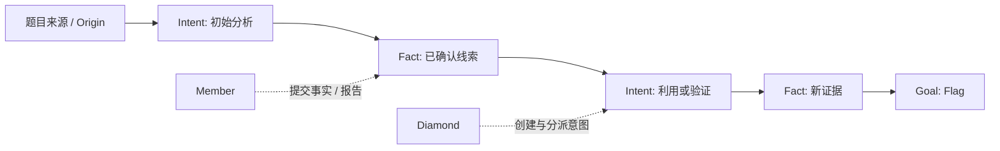
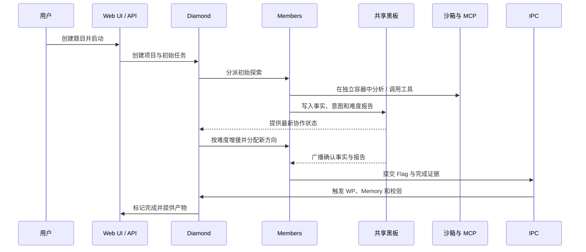

<p align="center">
  
</p>

<h1 align="center">IPC_CTFAgent</h1>

<h2 align="center"><strong>面向 CTF 的多智能体协作解题系统</strong></h2>
[](LICENSE)
[](https://www.python.org/downloads/)
[](https://www.docker.com/)
[](https://modelcontextprotocol.io/)
[](https://fastapi.tiangolo.com/)

---

**🧠 多智能体协作** · **📈 难度反馈调度** · **🕸️ 共享黑板图谱** · **🛠️ MCP 工具生态**

[🚀 快速开始](#-快速开始) · [✨ 核心创新](#-核心创新) · [🏗️ 系统架构](#system-architecture) · [📖 使用流程](#-使用流程)

</div>

---

## 📖 简介

**IPC_CTFAgent** 是一个面向授权 CTF 题目的多智能体解题系统。它将题目分析、工具调用、协作调度、解题记录与经验沉淀组织为一条可观察、可重放的闭环。

系统由 **Diamond** 统筹多个 **Member**。Member 在各自隔离的工作环境中探索并把已确认的事实、待办意图和难度报告写入共享黑板；Diamond 依据进度和难度按需分配更多成员，避免多个智能体在同一条路径上重复试错。找到 Flag 后，系统自动进入 Writeup、经验总结和完整性校验阶段。

支持 Web、Pwn、Reverse、Crypto、Misc、AI、OSINT 七类 CTF 题目，并提供 Browser、Ghidra、ZAP、记忆库、工具检索等异步 MCP 服务。Web UI 可以实时查看协作图谱、时间线、日志、记忆与最终 WP。

<p align="center">
  <a href="https://github.com/PureStream108/IPC_CTFAgent">
    
  </a>
</p>

---

## 🖼️ 展示

部分内部测试记录与界面截图见 [docs/Example.md](docs/Example.md)。

---

## 🚀 核心创新

### 1️⃣ Diamond–Member 动态协作与难度反馈

IPC 将“统筹决策”和“具体解题”拆为职责明确的角色：

- **💎 Diamond（调度者）**：启动初始 Member，接收进度与难度报告，为不同探索方向创建任务，并在没有可执行任务时基于最新事实规划下一步。
- **👥 Members（解题者）**：在独立上下文和独占沙箱中进行分析、调用工具、提交已验证的事实与任务结论；默认可配置四名 Member（Aventurine、Pearl、Jade、Topaz）。
- **📊 难度驱动扩容**：Member 以设定步数间隔评估难度。低难度任务保持单人推进；中、高难度任务会触发 Diamond 增援空闲成员，并优先分配不同的探索方向。
- **📣 及时共享**：新事实和难度报告会广播给运行中的其他 Member，帮助它们切换角度、复用证据并减少重复动作。

### 2️⃣ 共享黑板图谱（Blackboard Graph）

系统把解题过程显式建模为“**事实（Fact）—意图（Intent）**”图：



- **事实可追溯**：每一个已确认结论都有来源，后续任务可从对应事实继续推进。
- **意图可协作**：任务声明、领取、心跳、释放和结论都有状态记录，降低并行成员重复占用同一工作。
- **可视化与重放**：Web UI 展示 Agent、事实、意图、难度报告和生命周期连线；项目可导出 YAML 或按时间线回放。
- **状态受控**：项目遵循 `created → running → flag_found → wp_writing → memory_writing → completed` 的生命周期，也可停止后恢复。

### 3️⃣ 异步 MCP 工具层与按类型暴露

项目基于 Python 官方 `mcp` SDK 与 `FastMCP` 实现异步 Client/Server。单次任务中会复用 MCP 会话，支持进程内、stdio 与 Streamable HTTP 传输。

- **共享 MCP 服务**：`browser`、`ghidra`、`zap`、`memory`、`tool_search`、`tools`。
- **分类工具暴露**：创建项目时指定题型，Member 首先获得对应题型工具；若需要跨领域工具，可通过 `tool_search` 查询完整工具目录。
- **内置分析环境**：成员镜像内预置常见语言、调试/逆向/取证/密码学工具及多种 CTF 工具；需要时可在沙箱中继续安装工具。
- **共享能力与独立工作区并存**：Browser、Ghidra、ZAP 为共享服务；每个 Member 拥有独立容器、上下文和工作目录。

### 4️⃣ 解题经验与产物闭环

在 Flag 被确认后，系统会停止同项目的其他 Member，并由 Diamond 完成收尾：

1. 创建 Markdown WP 草稿文件；
2. 从已确认事实、难度报告和最终利用链中归纳知识、工具经验、利用方式与复盘建议；
3. 写入持久化 Memory；
4. 校验 Flag、目标边和 WP 文件均已存在后，标记项目完成并释放资源。

Memory 支持浏览、手动补充、关键词检索及导出为 Obsidian Vault，方便把一次题目的有效经验带到后续任务中。

---

## 核心能力

### 多题型工具与运行环境

| 题型 | 代表性能力 |
| --- | --- |
| **Web** | SQLMap、Dirsearch、Commix、Fenjing、WhatWaf、Shiro/JNDI 等 |
| **Pwn** | Pwntools、GDB、ROPgadget、One Gadget、Checksec |
| **Reverse** | Ghidra MCP、Radare2、Objdump、Angr、Strings |
| **Crypto** | RsaCtfTool、SageMath、CADO-NFS、OpenSSL、Z3/Fpylll |
| **Misc** | Binwalk、Steghide、Zsteg、ExifTool、Volatility3、YSoSerial |
| **AI / OSINT** | PyTorch、Keras、NumPy/SciPy、Curl、Nmap、元数据分析 |

Member 镜像还提供 Python、Java、Go、Rust、PHP、Node.js、Maven 等运行时。工具清单以 [`backend/tools/registry/`](backend/tools/registry/) 中的 YAML 注册表为准。

### Web 控制台

访问 `http://localhost:8000` 可完成：

- 新建项目、选择题型、添加题目来源/目标/提示，并上传附件；
- 启动、停止、恢复或删除任务；
- 查看协作图、节点详情、事实链、任务状态、报告和时间线；
- 查看 Member 思考、工具调用与协作日志；
- 在线维护 Diamond/Member 的 LLM 配置并做健康检查；
- 浏览或新增 Memory，查看与导出 WP、日志和记忆。

### 隔离与资源控制

- 每位 Member 默认使用独立 Docker 容器和独立工作目录；附件会复制到对应项目的可见目录。
- 可在 `config.yaml` 设置总 CPU、总内存、磁盘、单 Agent 内存与网络访问策略。
- 运行时会按单 Agent 内存配额准入；停止或完成项目后回收成员沙箱和题目环境。
- 题目附件中的 `Dockerfile` 或 `docker-compose.yml` 可作为项目挑战环境启动，供同一项目中的成员访问。

---

## 🗓️ 当前限制与路线图

- [ ] **资源占用优化**：多个 Member 并发运行时，镜像与分析工具会带来较高内存占用。
- [ ] **难度调度优化**：继续提高难度评估和分支分配的稳定性，减少不必要的增援。
- [ ] **评测扩展**：在更多中高难度题目与不同模型组合上验证协作策略。
- [x] **共享黑板与流程可视化**：事实、意图、成员调度、报告与生命周期均可在 Web UI 中查看。
- [x] **异步 MCP Client / Server**：支持进程内、stdio 与 Streamable HTTP 传输。
- [x] **经验沉淀与导出**：支持任务完成后写入 Memory，并导出 WP、日志和 Obsidian Vault。

---

## 📋 系统要求

| 组件 | 要求 | 说明 |
| --- | --- | --- |
| **操作系统** | Linux / macOS / Windows（Docker Desktop 或 WSL2） | 推荐使用 Docker 运行完整能力 |
| **Docker** | Docker Engine + Docker Compose v2 | 运行应用、ZAP 和 Member 沙箱 |
| **Python** | 3.11+ | 本地开发或直接运行服务时需要 |
| **LLM API** | Diamond 1 个、至少 1 个 Member 可用 | 可用 `openai`、`claudecode`、`deepseek`、`pi` 或 `mock` 格式 |
| **内存** | 默认总配额 20 GB | 每个 Member 默认最多 5 GB，可在配置中修改 |
| **网络与磁盘** | 首次构建需联网且有充足磁盘 | 镜像会安装 Ghidra、Chromium、SageMath 与大量 CTF 工具 |

> ⚠️ Docker 启动配置会将 Docker Socket 挂载给 `ipc-app`，以便它为 Member 创建隔离容器。这意味着应用具备管理 Docker 的高权限；请仅在可信、隔离的开发或比赛环境使用。

---

## 🚀 快速开始

### 步骤 1：获取项目

```bash
git clone https://github.com/PureStream108/IPC_CTFAgent.git

cd IPC_CTFAgent
```

### 步骤 2：配置 LLM

复制配置模板：

```bash
cp backend/config/config.example.yml backend/config/config.yaml
```

Windows PowerShell：

```powershell
Copy-Item backend\config\config.example.yml backend\config\config.yaml
```

编辑 `backend/config/config.yaml`。必须配置 Diamond，且至少配置一位 Member：

```yaml
diamond:
  api_format: openai      # openai / claudecode / deepseek / pi / mock
  api_key: sk-...
  base_url: https://your-llm-endpoint/v1
  model: your-model

members:
  - name: aventurine
    api_format: openai
    api_key: sk-...
    base_url: https://your-llm-endpoint/v1
    model: your-model

runtime:
  sandbox_backend: docker
  eval_interval_steps: 20
  max_member_steps: 60

limits:
  total_memory_gb: 20
  per_agent_memory_gb: 5
  network: true
```

也可在服务启动后从 Web UI 右上角的 **IPC** 面板更新配置并进行健康检查。

### 步骤 3：构建并启动

```bash
docker compose up -d --build
```

首次构建会下载基础镜像、Ghidra、语言运行时和 CTF 工具，耗时取决于网络和缓存。

确认服务状态：

```bash
docker compose ps
docker compose exec ipc-app ipc check
```

查看日志：

```bash
docker compose logs -f ipc-app
```

### 步骤 4：创建并运行题目

打开 **http://localhost:8000**，然后：

1. 点击 **New Project**；
2. 填写题目名称、来源、目标和提示，选择题型，必要时上传附件；
3. 点击启动；
4. 在图谱、时间线和日志面板观察 Diamond 与 Members 的协作；
5. 完成后从 **WP**、**Logs** 和 **Memory** 导出产物。

默认情况下，应用状态、项目附件、WP、日志和 Memory 存储于 Docker 命名卷。通过 UI 的 **Derive / Export** 功能导出的 WP 与日志分别写入宿主机的 `./Wp/` 与 `./logs/`。

### 本地开发运行（可选）

如果已准备好 Python 环境和 Docker SDK，可在宿主机运行 API 与 UI：

```bash
python -m venv .venv
source .venv/bin/activate  # Windows: .venv\Scripts\activate
pip install -e ".[docker]"
cp backend/config/config.example.yml backend/config/config.yaml
ipc check
ipc serve --reload
```

本地模式同样默认使用 Docker Member 沙箱，需提前构建 `ipc-member:latest` 镜像：

```bash
docker compose build ipc-member-image
```

---

## 📖 使用流程



### 项目生命周期

```text
created → running → flag_found → wp_writing → memory_writing → completed
                    ↘
                     stopped → running
```

`completed` 状态要求 Flag 已记录、黑板中存在通向目标的完成边，并且 WP 文件已经生成。这样可避免仅凭模型输出便错误宣布题目完成。

---

## <a id="system-architecture"></a>🏗️ 系统架构

```text
┌──────────────────────────────────────────────────────────────┐
│                         用户与 Web UI                          │
│  新建题目 · 附件上传 · 图谱 / 时间线 · 日志 · WP · Memory      │
└───────────────────────────┬──────────────────────────────────┘
                            │ FastAPI
┌───────────────────────────▼──────────────────────────────────┐
│                    调度与生命周期层                            │
│  IPC 校验器 ── Diamond ── Orchestrator ── Resource Manager    │
│       Flag/WP 校验     动态分派/增援        生命周期/资源回收   │
└───────────────────────────┬──────────────────────────────────┘
                            │
┌───────────────────────────▼──────────────────────────────────┐
│                     共享状态层（SQLite）                       │
│  Blackboard: Facts · Intents · Agents · Reports · Links        │
│  Memory: Knowledge · Tool Usage · Exploit · Lessons            │
└───────────────┬───────────────────────────────────┬──────────┘
                │                                   │
┌───────────────▼──────────────┐      ┌─────────────▼───────────┐
│  Member × N（独立上下文）     │      │     MCP 能力层           │
│  分析、推理、提交报告与结论   │◄────►│ memory · tool_search     │
│  独占 Docker Sandbox          │      │ browser · ghidra · zap   │
└───────────────┬──────────────┘      └─────────────────────────┘
                │
┌───────────────▼──────────────────────────────────────────────┐
│          题型工具注册表、CTF 工具镜像与项目挑战环境             │
│  Web · Pwn · Reverse · Crypto · Misc · AI · OSINT             │
└──────────────────────────────────────────────────────────────┘
```

### 目录结构

```text
IPC_CTFAgent/
├── backend/
│   ├── api/                 # FastAPI 路由：项目、求解、图谱、日志、WP、Memory
│   ├── blackboard/          # SQLite 黑板：事实、意图、成员、报告和关系
│   ├── config/              # 配置模板与运行配置 config.yaml
│   ├── core/                # 调度器、Diamond、生命周期、回放、日志、WP/Memory 写入
│   ├── mcp/                 # 官方 MCP SDK 的异步 client/server 与共享服务
│   ├── members/             # Member 抽象、LLM 适配器和工厂
│   ├── memory/              # 持久化经验库、检索与 Obsidian 导出
│   ├── sandbox/             # Docker/本地沙箱、资源限制和项目网络
│   ├── server/static/       # 单页 Web UI
│   └── tools/               # 工具注册表与 tools/tool_search MCP
├── docker/member/           # Member 工具镜像 Dockerfile
├── docs/                    # 示例与补充文档
├── tests/                   # API、调度、MCP、Memory、沙箱测试
├── docker-compose.yml       # ipc-app、ZAP 与 Member 镜像编排
├── Dockerfile               # 主应用镜像
└── pyproject.toml           # Python 包、依赖与 CLI 定义
```

---

## 🔌 异步 MCP Client / Server

每个 MCP 工具处理器均为异步函数；Member 在一次任务内复用同一 `ClientSession`。以下命令可独立调试 MCP 服务。

启动 stdio Server：

```bash
python -m backend.mcp.mcp_server browser
```

通过异步 Client 调用工具：

```bash
python -m backend.mcp.mcp_client browser navigate \
  --arguments '{"url":"https://example.com"}'
```

启动 Streamable HTTP Server：

```bash
python -m backend.mcp.mcp_server browser \
  --transport streamable-http --host 0.0.0.0 --port 8100
```

在 Python 中复用会话：

```python
from backend.mcp.shared import build_browser_mcp
from backend.mcp.mcp_client import MCPClient

async with MCPClient.in_process(build_browser_mcp()) as client:
    tools = await client.list_tools()
    result = await client.call_tool("navigate", {"url": "https://example.com"})
```

可用 Server 名称：`memory`、`tool_search`、`tools`、`browser`、`ghidra`、`zap`。其中 `memory`、`tool_search` 与 `tools` 可传入 `--root` 指定 IPC 数据目录，`tools` 还可通过 `--category` 指定题目分类。

---

## 🔐 安全与使用免责声明

**本项目仅供合法授权的 CTF、靶场、教学和研究用途。** 使用者须自行确认并承担以下责任：

- 仅针对自己拥有或已获得明确书面授权的目标、附件与网络环境运行系统；
- 不将自动化扫描、命令执行、漏洞验证等能力用于未授权访问；
- 在虚拟机、专用 Docker 主机或其他隔离环境中运行，避免将敏感宿主机数据暴露给 Agent；
- 妥善保护 LLM API Key、题目附件、日志与 WP，避免把凭据提交到仓库或共享到不可信环境；
- 开发者和贡献者不对不当使用造成的损失、数据泄露或法律后果承担责任。

若不同意以上条款，请勿使用本项目。

---

## 🤝 贡献

欢迎提交 Bug、测试题目、工具注册表、文档和代码改进。

1. Fork 本仓库并创建功能分支；
2. 为修改补充或更新相应测试；
3. 运行测试：`pytest`；
4. 提交清晰的 Pull Request，说明动机、实现和验证方式。

工具扩展通常只需在 [`backend/tools/registry/`](backend/tools/registry/) 增加或更新对应题型的 YAML 定义；请同时说明适用场景、调用方式和依赖。

---

## 📝 许可证

本项目采用 [GNU Affero General Public License v3.0](LICENSE) 开源。

---

## 📞 联系与反馈

- [GitHub Issues](https://github.com/PureStream108/IPC_CTFAgent/issues)：报告 Bug 或提出功能建议
- [GitHub Pull Requests](https://github.com/PureStream108/IPC_CTFAgent/pulls)：提交代码与文档改进
- [项目主页](https://github.com/PureStream108/IPC_CTFAgent)
