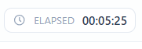

首先我们挑选一道新生赛题目（难度在 Low ~ Medium 间），然后设定为：

然后让GPT5.4跑一下，结果是：

结果GPT5.4在1m16s解出来了，给了给非预期

~~我们的 IPC 耗时 45m 调用了全部 Agent 然后给了个预期解没绷住.....~~

经过多次测试......再没有特定优化某一类题型和更改模型的前提下，取得了阶段性胜利，这次还调用库失败了，不然应该会快几步

简单题由于短任务运行，只要花费时间不是过分长就是在预料之内，等这几天看看中难问题